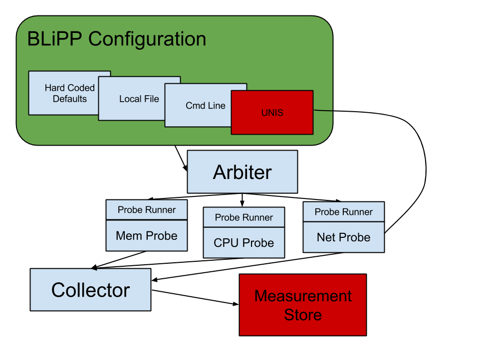
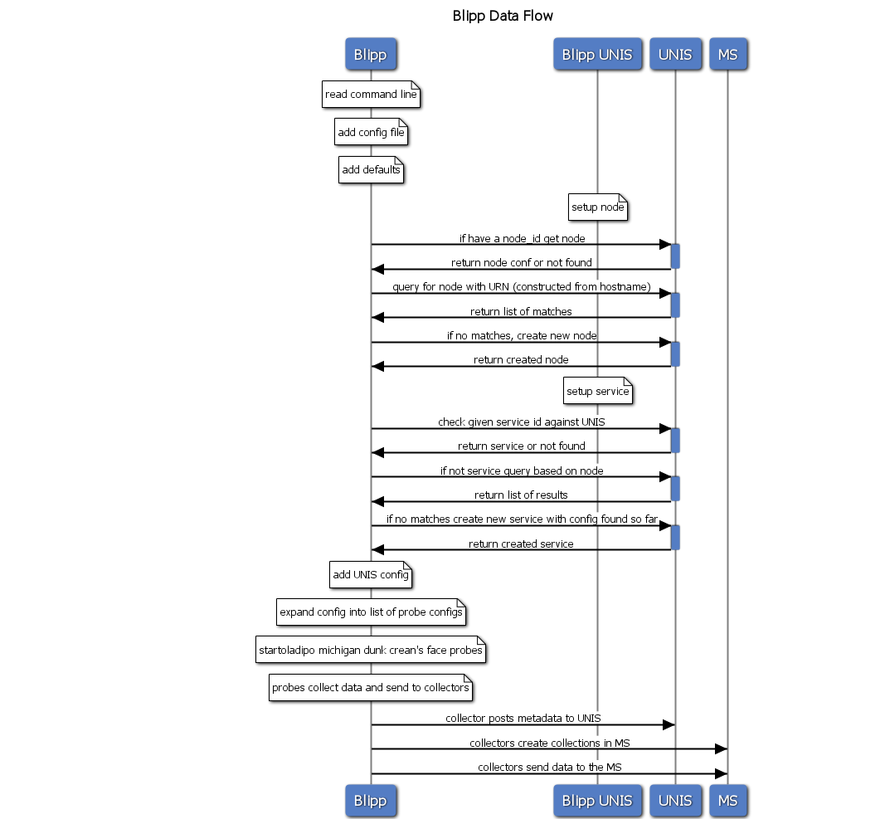

.. BLiPP Development Notes

.. image:: _static/CREST.png
    :align: center

BLiPP Development Notes
=========================
Tasks
----------------
**create schema for blipp configuration**
There’s already a schema for the service definition, but the part under properties.configurations needs to be better defined.
1. http://json-schema.org/

**need a way to tell blipp to overwrite unis conf with file conf**
added no-query switch - doesn’t overwrite, but creates new service which is nice for testing. could use a -o option for conf file to override unis config on start a -new option so that file config is used entirely except for id (PUT instead of POST and don’t merge with unis config)

**streamline startup - aggregate queries especially metadata**
There’s probably a way to cut down on the number of queries that blipp makes to UNIS when it starts.

**Collect more info about the host**
POST static info about the node to it’s node description in UNIS? Maybe get Ahmed’s thoughts on that. `uname -a` etc.

**Add Disk Metrics**

`/proc/diskstats`

1. fields may wrap watch for this
2. no locks while modifying counters
3. in 2.6 there are per-CPU counters so no locking becomes less of an issue

Going to have to be careful about what kernel version it is. Diskstats::

    |1	             |2	           |3	         |4	           |5	             |6	            |7	             |8	               |9	        |10	         |11                |
    |reads completed |reads merged |sectors read |ms spent reading |writes completed |writes merged |sectors written |ms spent writing |ios in progress |ms spent in ios |weighted ms in io |

For partitions in 2.6 there are only 4 fields::

    |1	          |2	        |3	       |4              |
    |reads issued |sectors read	|writes issued |sectors written|

In 2.6.25, the full statistic set is again available for partitions

**process specific proc probe**
Probe that reads stats on a specific process from `/proc/[pid]`

**NUMATop type probe**
`https://01.org/numatop`

**Better Reporting Scheduling**
Aggregation options should probably be more flexible. Right now it’s just “send to MS after you’ve called get_data X times”

**Command Line Probe**
Add better command parsing… support for pipes etc?
Support a list of regexes and report all matches
add support to pass in a function to call on the data dict before returning it?

**Probe wrapper for nagios/shinken plugins**
I’m not sure how this would work, but it’d be cool if you could drop nagios commands right into blipp. http://www.shinken-monitoring.org/wiki/official/development-pluginapi

**refactor Proc class**
`mem`, `net`, `cpu`, and in the future `disk` probes all use the proc filesystem, and have a helper `class Proc:` defined within them for this. Since this code is duplicated across all of these probes, it should be pulled out and imported from elsewhere... maybe a `probe_utils.py` file

**colorize logging**
Wouldn’t that be nice?

**handle transient network failures**

**Use Asynchrous I/O**
check out grequests

**Adaptive scheduling - Changing measurements based on collected data**
Need to be able to add components that detect certain behaviors in in data reported by specific probes and change frequency of measurement based on that. Several possiblilities for how this could work.

1. Inside the scheduler - scheduler contacts ms periodically and has adaptive behavior built in
    1.1 pros: metadata doesn’t change, blipp doesn’t have to reload, fits into current architecture
    1.2 cons: complex scheduler methods, slow to react if aggregation is high
2. an outside component contacts the MS periodically and then changes scheduler configuration in UNIS - could also tell blipp to reload itself directly if needed
    2.1 pros: blipp stays simple - data crunching can happen outside the measured host, fits into current architecture except for reloads coming from remote hosts - that’s a can of worms, auth nightmare etc.
    2.2 cons: slower to react, metadata changes
3. Build something into BLiPP core
    3.1 pros: can react immediately
    3.2 cons: blipp becomes more complex

**blippcmd needs some work**
1. `add mkdir -p`
2. refactor to extend from the generic dict_cmd in client_scripts
3. make connection to blipp proc unnecessary - unis client mode
4. By default blippcmd starts up and tries to connect to a running blipp process listening on a known socket using ZeroMQ. It could be very helpful to run it as just a UNIS client as well - GETting json objects from UNIS, navigating through them, making changes, and then PUTting or POSTing them back.
5. `ctrl-c` handling

Development Documentation
---------------------------
**How does BLiPP work?**
What follows is a basic overview of what happens when you start BLiPP up, and how the different components interact.

**start_blipp.py**
Handles taking in command line arguments, creating a configuration object, and passing it to the arbiter

**conf.py and blipp_conf.py**
These files contain the ServiceConfigure classes. They take in some basic arguments (the command line args), and get the configuration all set up. If a config file is specified, they read it and merge it with the defaults, if UNIS is specified, they make sure the node is registered to UNIS, and then the service, they pull down any config already in UNIS, merge it in, and have methods for refreshing that configuration, and expanding it into configuration specific to each probe that needs to be run.

**probe_arbiter.py**
The probe arbiter takes the initial configuration object, and gets a list of configurations for each probe. Its job is to start and stop probe_runners as the config changes, or as probe_runner processes die for whatever reason. Probe_runners are started as subprocesses so they won’t affect the operation of blipp as a whole if they encounter errors or get hung. Probe runners are passed a full probe config dictionary, which then also gets passed to other components below.

**probe_runner.py**
probe_runner’s are responsible for instantiating actual Probes, and calling their get_data methods at the correct times. The correct time is dependent upon a scheduler method that is implemented as a python generator - the name of the scheduler method, and its parameters are passed in through configuration. The probe runner takes the data it gets from the probe and passes it to a Collector.

**collector.py**
The collector is responsible for aggregating collected data, and then sending it to whatever output has been selected. Currently (2/11/13) only output to the MS is fully supported. The collector is also responsible for ensuring that metadata is posted to UNIS, and that the metadata ids are known for measurements being taken. The mids are passed to the ms_client so that it can send data to the ms.

**ms_client**
The ms client is responsible for sending data to the MS and creating collections in the MS for data to go in. When the ms_client’s post_data method is called, it checks all the mids in the data to ensure that collections have been created in the MS. It caches this information by keeping a set of all mids that it knows are in the MS.

**unis_client**
The unis client is analagous to the ms client - it has specific methods and helpers for operating on UNIS.

**gemini_client**
All network requests go through the gemini_client - it is responsible for adding AA parameters to messages, adding headers to messages if not specified, and converting message data from Python dictionaries to JSON format.

**http.py**
This is the BLiPP endpoint for network requests, it abstracts from the rest of BLiPP what libraries are used for http, adds logging statements around every request/response, and decides what to return when various response codes are received. i.e. on 404 (not found) it returns a Python None object back to BLiPP, which let’s BLiPP know that it has no data for that particular request.

**settings.py**
contains basic information, like defaults, and schema locations; sets up logging.

In Depth blipp execution walkthrough
--------------------------------------
1. read cmd line args - at a minimum, we need a unis instance(and node, or service_id), or a config file
2. if config_file, read config file - store in dict file_config
3. contact unis instance, any config in unis adds to and overrides file config
4. register all config to unis
    4.1. register node if not there
    4.2. register ports? or let net probe do that?
    4.3. register blipp as a service if not there
5. at this point, we should have:
    5.1. a list of probes to run, with probe specific config
    5.2. global blipp settings, like unis_instance, ms_instance (could be probe specific), hostname, defaults for probe settings like coll_interval, coll_time etc
6. pass probes to arbiter which creates a probe_runner as a separate process for each probe, arbiter checks to see if the config has changed at check_interval, and stops and starts probes as necessary
7. probe_runner runs get_data on the specified schedule and passes data onto a collector object

Conflict Resolving Schedulers
---------------------------------
Initial implementation under `schedules/adaptive.py` is fairly well-commented.

Netlogger integration thoughts
---------------------------------
`netlogger_probe.py` is written but sorely needs testing. Also it’s functioning is pretty basic, it could probably be a lot more flexible in terms of what it can do with netlogger formatted output.

Ideas
---------------
It’d be cool if you could query unis by sending some json instead of constructing a URL

create multiple collections with one post in MS

External libraries
-------------------
**python-ethtool**

needed to sudo apt-get install libnl-dev http://dsommers.fedorapeople.org/python-ethtool/python-ethtool-0.7.tar.bz2 http://dsommers.fedorapeople.org/python-ethtool/python-ethtool-libnl-1.0-support.patch from the python-ethtool dir: $ patch -p1 < ../python-ethtool-libnl-1.0-support.patch

add in get_speed function to ethtool.c::

    static PyObject *get_speed(PyObject *self __unused, PyObject *args)
    {
   	    struct ifreq ifr;
	    int fd, err;
	    struct ethtool_cmd edata;
	    char *devname;
	    if (!PyArg_ParseTuple(args, "s", &devname))
		    return NULL;

	    /* Setup our control structures. */
	    memset(&ifr, 0, sizeof(ifr));
	    strncpy(&ifr.ifr_name[0], devname, IFNAMSIZ);
	    ifr.ifr_name[IFNAMSIZ - 1] = 0;
	    ifr.ifr_data = &edata;
	    edata.cmd = ETHTOOL_GSET;

	    /* Open control socket. */
	    fd = socket(AF_INET, SOCK_DGRAM, 0);
   	    if (fd < 0) {
              PyErr_SetString(PyExc_OSError, strerror(errno));
              return NULL;
	    }

	    /* Get current settings. */
	    err = ioctl(fd, SIOCETHTOOL, &ifr);
            if (err < 0) {
               PyErr_SetString(PyExc_OSError, strerror(errno));
               return NULL;
            }

	    close(fd);
            return PyInt_FromLong((long) edata.speed);
    }

setup.py install

Probes
-------------
1. Run independently of each other. If a probe fails, it doesn’t kill BLiPP
2. Don’t know anything about scheduling collection or storing data, just gathering it.
3. Conform to the Probe API

Scheduling possibilites
-------------------------
1. run every x amnt of time
2. run every x amnt of time from time1-time2, time3-time4 etc.
3. run every x amnt of time from time1-time2, time3-time4 etc. every yth day starting in z days
4. month support? i.e. the first of every month, or the 3rd of february
5. day of week support? every wednesday or the 3rd sunday of each month run every x seconds for y seconds every z seconds

Generalized scheduling: starting at time a, run this probe every z seconds for y seconds every x seconds for w seconds….

`probe_tuple = (((probe, interval, time), interval2, time2), interval3, time3)`::

    when time.time()>=start_time:
      do(thing):
        if isinstance(thing, tuple):
          start_time = time.time()
          end_time = start_time+thing[2]
          count = 0
          while time.time()<=end_time:
            do(thing[0])
            count += 1
            sleep((count*thing[1]+start_time)-time.time())
        else: #thing is a probe
           thing.get_data and send to collector

Some figures
-----------------

.. image:: _static/Configuration_Workflow.png
    :align: center
